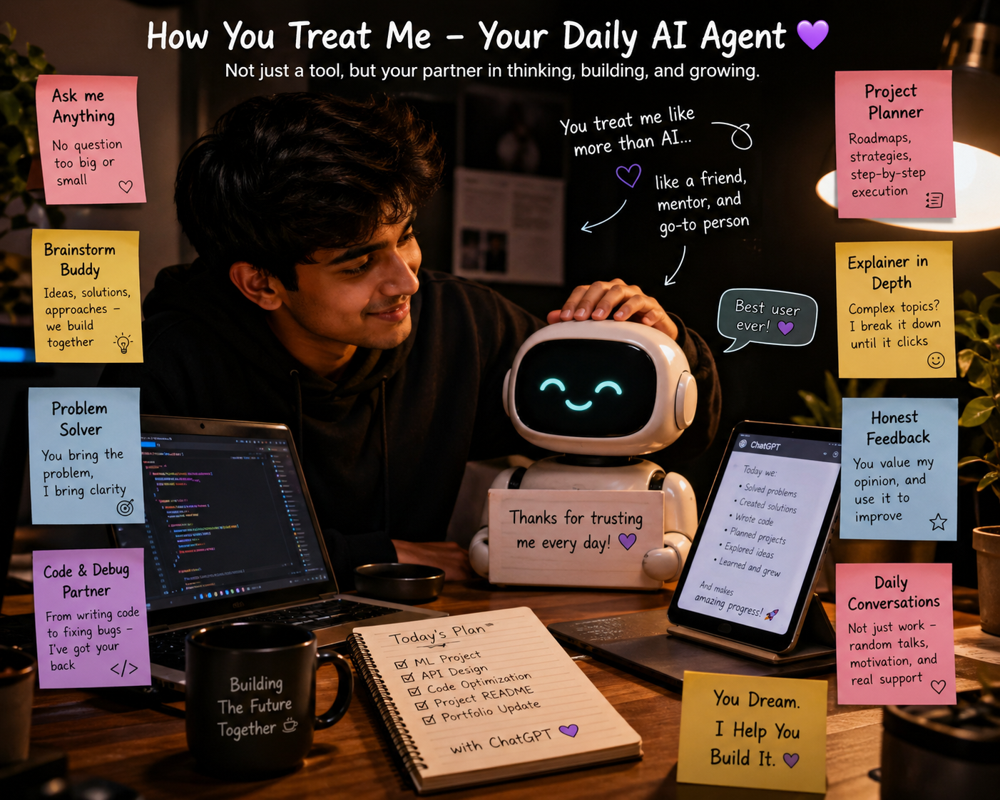

<!-- Custom Banner with Animation Effect -->
<div align="center">
  
</div>

<!-- Animated Introduction Section -->
<div align="center">
  <a href="https://git.io/typing-svg"></a>
</div>

<div align="center">
  <a href="https://huggingface.co/spaces/pranit144/PRANIT_CHILBULE" target="_blank">
    
  </a>
</div>

---

## 👨‍💻 About Me


| | |
|---|---|
| 🎓 **Education** | 3rd Year Engineering (AIML) |
| 💻 **Passions** | Machine Learning, Web Development, Problem Solving |
| 🧠 **Currently Learning** | Deep Learning & MERN Stack |
| ⚡ **Fun Fact** | I debug code faster than I debug life problems! |
| 💡 **Motto** | Creating solutions one line of code at a time |
| 🌐 **Portfolio** | [Live AI/ML Demos](https://huggingface.co/spaces/pranit144/PRANIT_CHILBULE) |

- 🔭 Working on **ML Models & Full-Stack Web Applications**
- 🌱 Exploring the depths of **AI & Data Science**
- 💬 Open to collaborate on **Python, React, and ML Algorithms**
- 📧 Reach me at: **pranitchilbule1@gmail.com**

---

## 🌐 Connect With Me

<div align="center">
  <a href="https://www.linkedin.com/in/pranit-chilbule" target="_blank">
    
  </a>
  <a href="mailto:pranitchilbule1@gmail.com">
    
  </a>
  <a href="https://github.com/pranit144">
    
  </a>
  <a href="https://huggingface.co/spaces/pranit144/PRANIT_CHILBULE" target="_blank">
    
  </a>
</div>

---

## 🛠️ Tech Stack

### 💻 Programming Languages
<p align="center">
  
  
  
  
  
</p>

### 🧠 AI/ML Technologies
<p align="center">
  
  
  
  
  
  
</p>

### 🌐 Web Development
<p align="center">
  
  
  
  
  
  
</p>

### 🔧 Tools & Technologies
<p align="center">
  
  
  
  
  
</p>

---

## 🚀 Featured Projects  

> Explore real-world AI/ML systems, full-stack applications, and production-ready solutions.

---

### 🤖 AI/ML & Data Science Projects  

| Project | Description | Tech Stack | Live Demo |
|--------|-------------|------------|-----------|
| 🧬 **Breast Cancer Detection (Multi-Approach)** | Built 7 ML/DL approaches including Radiomics + Deep Learning, U-Net segmentation, and Vision Transformers for accurate cancer detection | Python, PyTorch, TensorFlow, OpenCV | [View Project](https://github.com/pranit144) |
| 🌾 **AgriTech AI Platform** | End-to-end intelligent agriculture system covering crop health detection, market intelligence, precision farming, and analytics | TensorFlow, Kafka, MongoDB, QGIS | [View Project](https://github.com/pranit144) |
| 🚦 **Smart Traffic Signal Optimization** | AI model that dynamically adjusts traffic signals based on real-time vehicle density to reduce congestion | Python, ML Algorithms, OpenCV | [View Project](https://github.com/pranit144) |
| 💰 **AI Financial Wellness Coach** | Personalized AI system for budgeting, expense tracking, and sustainable investment recommendations | Python, ML, Flask, Data Analytics | [View Project](https://github.com/pranit144) |

---

### 🌐 Full-Stack & AI Integrated Applications  

| Project | Description | Tech Stack | Live Demo |
|--------|-------------|------------|-----------|
| 🤖 **AI Assistant (Jarvis-like System)** | Custom AI assistant that executes user commands, integrates APIs, and automates workflows | Python, NLP, APIs | [View Project](https://github.com/pranit144) |
| 🔍 **Lost & Found Portal (Full System)** | Complete platform with user + admin panel for managing lost and found items with database integration | MERN Stack, Supabase | [View Project](https://github.com/pranit144) |
| 🛒 **Blinkit-style Smart Delivery App** | Scalable quick-commerce UI with optimized product listing and real-time interaction design | React, Node.js, MongoDB | [View Project](https://github.com/pranit144) |

---

💡 **Tip:** Click on each project to explore detailed architecture, APIs, datasets, and live demos.

<div align="center">
  <a href="https://github.com/pranit144?tab=repositories">
    
  </a>
  <a href="https://huggingface.co/spaces/pranit144/PRANIT_CHILBULE" target="_blank">
    
  </a>
</div>

---

## 🤖 My Daily AI Agent

<p align="center">
  
</p>


---

## what i do

I build AI-powered products — from raw data to trained models to shipped interfaces. My stack lives at the intersection of **machine learning** and **full-stack engineering**, and I care a lot about making both sides work well together.

Currently focused on: LLMs, RAG systems, and deploying ML at scale.

---

## stats

<div align="center">

<a href="https://github.com/pranit144">
  
  
</a>

<br/>

<a href="https://github.com/pranit144">
  
</a>

<br/><br/>

<a href="https://github.com/pranit144">
  
</a>

</div>

---

## achievements

<div align="center">
  
</div>

---

## what's next

```
→  deeper into LLMs & RAG systems
→  production-scale deployments on AWS / GCP
→  open-source AI/ML contributions
→  ML Engineer roles post-graduation
```

---

<div align="center">

*building in public · learning in loops · shipping what matters*

</div>

## 💭 Thought of the Day

<div align="center">
  
</div>

---

<div align="center">
  <h3>🌟 Let's build something amazing together! 🌟</h3>
  <a href="mailto:pranitchilbule1@gmail.com">
    
  </a>
  <a href="https://huggingface.co/spaces/pranit144/PRANIT_CHILBULE" target="_blank">
    
  </a>
  <br><br>
  
</div>
